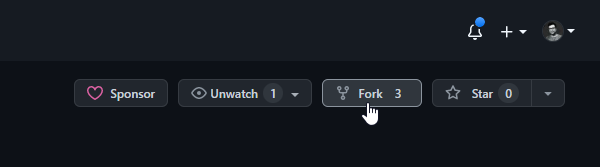

# Contributing Guidelines

We welcome contributions from all interns at Afkanerd Technologies! This document outlines the steps you should take to contribute your progress updates to this repository.

## Getting Started

1. Fork this repository to your own GitHub account by clicking the "Fork" button in the top right corner of this page.



2. Clone the forked repository to your local machine by running the following command in your terminal:

```
git clone https://github.com/YOUR-USERNAME/internship-progress-tracker.git
```

Make sure to replace `YOUR-USERNAME` with your own GitHub username.

3. Create a new branch for your progress updates by running the following command:

```
git checkout -b my-progress-updates
```

Replace `my-progress-updates` with a descriptive name for your branch.

4. Inside your intern folder, create a new markdown file for each week of your internship, and document what you worked on, what you learned, and any challenges you faced that week. You can do this using your favorite text editor or IDE.
5. When you're done with your updates for the week, add a link to the table of contents in your README.md file. You can use the following syntax: `[Week X: Date Range](./weekX.md)`

## Formatting Guidelines

When creating your progress update markdown files, please follow these guidelines:

- Use the following naming convention for your files: `week1.md`, `week2.md`, `week3.md`, etc.
- Start each file with a heading that includes the week number, the start date, and the end date of the week. For example: `## Week 1: May 1 - May 7`.
- Use proper formatting to make your update easy to read. This includes:
  - Use appropriate headings and subheadings to break up your update into sections.
  - Use bullet points or numbered lists to make your points clear.
  - Use bold or italic formatting to emphasize key points.
  - Use code blocks or inline code formatting to display code snippets.
  - Use images or screenshots to help illustrate your progress.
- Include a brief summary of what you worked on during the week, what you learned, and any challenges you faced.
- Be honest and reflective about your progress. If you faced any setbacks or challenges, include them and explain how you overcame them.
- Avoid sharing any proprietary or confidential information about Afkanerd Technologies or its clients.
- Double-check your spelling and grammar before submitting your update.

Here's an example of what your progress update markdown file might look like:

```
## Week 1: May 1 - May 7

### What I worked on

During my first week at Afkanerd Technologies, I spent most of my time getting set up and familiarizing myself with the tools and technologies I'll be using during my internship. I completed the following tasks:

- Installed and set up Visual Studio Code, Git, and Node.js on my local machine.
- Completed the Getting Started tutorial on the React website to brush up on my React skills.
- Joined my team's daily standup meetings and got to know my fellow interns and mentors.

### What I learned

Through completing these tasks, I learned the following:

- How to set up and configure my local development environment.
- How to use Git for version control and collaborate with others on a project.
- How to create a simple React application using JSX and components.

### Challenges I faced

The main challenge I faced this week was getting familiar with the command line interface. I had only used GUI-based tools before, so it took some time to get used to navigating and executing commands through the terminal.

### Next steps

Moving forward, I plan to focus on deepening my understanding of React and exploring some of the other technologies used by my team. I also want to start working on some small coding exercises to practice what I've learned so far.
```

Remember, your progress updates should be a reflection of your personal experience and growth during your internship. Use them to document your achievements, reflect on your challenges, and celebrate your successes!

## Contributing Your Changes

When you're done with your progress updates for the week, commit your changes to your branch and push them to your forked repository by running the following commands:

```
git add .
git commit -m "Add progress updates for week 1"
git push origin my-progress-updates
```

Replace `"Add progress updates for week 1"` with a descriptive commit message that summarizes the changes you made.

Finally, create a pull request from your branch to the `main` branch of the original repository by clicking the "New pull request" button on the repository page.


We'll review your changes and merge them into the repository if they meet our standards.

## Guidelines for Contributions

To ensure that this repository remains a helpful and valuable resource for interns, we ask that you follow these guidelines when making contributions:

### Be professional and respectful

Remember that this repository is a professional resource, and your contributions should reflect that. Avoid using offensive language, and be respectful of other contributors and their work.

### Keep it relevant

Your progress updates should be relevant to your internship at Afkanerd Technologies. While it's fine to include personal anecdotes or reflections, the majority of your updates should relate to your work at the company.

### Respect confidentiality

Remember that you may be working on sensitive or confidential projects during your internship. Do not share any proprietary or confidential information in this repository or with anyone outside of your internship team at Afkanerd Technologies.

### Ask for help

If you have any questions or concerns about using this repository, please reach out to your internship coordinator or mentor at Afkanerd Technologies. We're here to help you make the most of your internship experience.

### Include images and code snippets

If appropriate, feel free to include images, code snippets, or other resources that help to illustrate your progress. To include an image, you can use the following syntax: 

```

```

To include a code snippet, you can use the following syntax:

`````
```python
# Your code here
```
`````
## Code of Conduct

Please note that by contributing to this project, you are agreeing to abide by the [Contributor Covenant Code of Conduct](https://www.contributor-covenant.org/version/2/0/code_of_conduct.html). All contributors are expected to adhere to this code of conduct.
